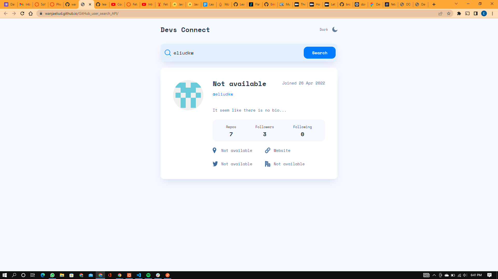

## Dev's Connect

### Table of Content
- [Description](#description)
- [Features](#features)
- [Behaviour Driven Development](#Behaviour-Driven-Development)
- [Requirements](#requirements)
- [Installation Process](#installation-Process)
- [Live Link](#Live-Link)
- [Technology  Used](#technology-Used)
- [Licence](#licence)
- [Authors Info and Acknowledgment](#Authors-Info-and-Acknowledgment)
***

### [Description](#description)
In this project, we use GitHub users API to pull  user profile data and display  a specific user from the typed input.

 ****
### [Features](#features)
* Search bar
* list user profile
* [Figma Design](#https://www.figma.com/file/MahTWj2RHyPUd4xzgHePYZ/Devs-Connect?node-id=0%3A1)  

***
### [Behaviour Driven Development](#Behaviour-Driven-Development)
* User story: I can search for a user
* User story: I can see a user profile
* User story: I can see a user stats and bio

 ****
### [Requirements](#requirements)

* Access to  a computer or an electronic device
* Access to stable internet

 ****
### [Installation Process](#installation-Process)

* Clone to this repo : git clone git@github.com:wanjaeliud/GitHub_user_search_API.git
* Unzip the downloaded files in a folder of choice.
* Open the index file from the zipped file with any browser.

***
### [Live Link](#Live-Link)

- Click the live link at the about section in the main branch or direct link below  
- [live link](#https://wanjaeliud.github.io/GitHub_user_search_API/)

***
### [Technology Used](#technology-Used)
* HTML - to develop the structure of the pages.
* CSS - to style the User Interface.
* JavaScript - to build the logic

 ****
### [Licence](#licence)

 ****
### [Authors Info and Acknowledgment](#Authors-Info-and-Acknowledgment)

* LinkedIn - [Eliud Wanja](https://www.linkedin.com/in/eliud-wanja)